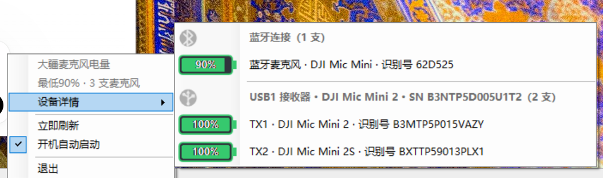

# 大疆麦克风电量

在 Windows 通知区域实时显示 DJI Mic Mini 电量的轻量托盘程序，支持蓝牙与 USB 无线双接入，也支持同时连接多个麦克风和多个 USB 接收器。

完整的安装、使用、升级、故障排查和技术边界请参阅：[软件说明](docs/软件说明.md)。

## 支持的连接模式

- **大疆蓝牙连接**：读取 DJI Mic Mini 通过 Windows HFP 上报的电量百分比
- **USB 无线连接**：通过 DJI Mic Mini 接收器读取 TX1/TX2 的无线发射器电量档位和充电状态
- **双接入与多设备**：蓝牙和 USB 同时读取；一个托盘图标显示所有在线麦克风中的最低电量

## 界面截图

### 状态栏悬停提示


悬停提示使用蓝牙与 USB 图标区分接口，每支麦克风一行，只显示型号短名和电量，不显示序列号。

### 设备详情



设备详情按蓝牙和 USB 接收器分组；每支麦克风独占一行，电池图标中央直接显示百分比，并列出设备型号和识别信息。

## 功能

- Windows 通知区域电池图标，颜色和填充量跟随电量档位
- 蓝牙连接时读取 Windows HFP 电池指示并显示设备上报的百分比
- 悬停以 `📶`、`🔌` 区分蓝牙和 USB，并逐行显示型号短名与电量，不显示序列号
- 右键“设备详情”逐项显示所有麦克风的电量与充电状态
- 设备详情按蓝牙与各 USB 接收器分组，每支麦克风独占一行并显示百分比电池图标
- 读取并显示麦克风产品类型与识别号，可区分 `DJI Mic Mini`、`DJI Mic Mini 2`、`DJI Mic Mini 2S`
- 正常电量使用绿色；估算低于 10% 使用橙色；5% 使用红色
- 右键菜单支持设备详情、立即刷新、开机自动启动和退出
- 每 8 秒同时刷新蓝牙和 USB；蓝牙掉线后自动排除其旧电量并切换到 USB
- 保持 USB Audio 接口原驱动，不影响麦克风录音

蓝牙模式不需要 WinUSB。当前实机已验证 `DJI Mic Mini-62D525` 的免提录音端点、电量显示和掉线切换；程序只把状态为 Active 的免提录音端点视为在线，避免继续显示断开前的旧电量。设备通过 HFP 向 Windows 上报的是百分比，因此不会标注“约”。

USB v2 身份帧会提供接收器和发射器的序列号、产品名称。详情菜单按接收器归类 TX1/TX2，并直接使用设备上报的产品名称；未取得身份帧时明确显示“未识别”，不会根据接口编号猜测型号。

DJI USB 协议返回的是 1–7 档电量状态，不是精确百分比。界面按以下映射显示百分比，但不再添加“约”或波浪号；这些 USB 数值仍属于档位换算结果：

| DJI 档位 | 悬停显示 | 图标颜色 |
| --- | --- | --- |
| 1 | 100% | 绿色 |
| 2 | 80% | 绿色 |
| 3 | 60% | 绿色 |
| 4 | 40% | 绿色 |
| 5 | 20% | 绿色 |
| 6 | 9% | 橙色 |
| 7 | 5% | 红色 |

这些百分比只用于粗略视觉判断，不代表 DJI 提供的精确剩余电量。

## 系统要求

- Windows 10/11 x64
- 蓝牙模式：DJI Mic Mini 已在 Windows 中配对，并启用 `Hands-Free` 录音端点
- USB 模式：接收器 Interface 6 使用 WinUSB，音频接口保持 Windows USB Audio 驱动

## 使用发行版

从仓库 Releases 下载 `大疆麦克风电量.exe`，双击即可运行。首次启动后可在托盘右键菜单中启用开机自启。

## 从源码构建

不需要额外安装 .NET SDK，构建脚本使用 Windows 自带的 .NET Framework C# 编译器：

```powershell
powershell -ExecutionPolicy Bypass -File .\scripts\build.ps1
powershell -ExecutionPolicy Bypass -File .\tests\model.test.ps1
```

输出文件位于 `dist\大疆麦克风电量.exe`。

安装到当前用户并启用开机自启：

```powershell
powershell -ExecutionPolicy Bypass -File .\scripts\install.ps1
```

卸载：

```powershell
powershell -ExecutionPolicy Bypass -File .\scripts\uninstall.ps1
```

## 实现说明

蓝牙模式只读访问 DJI `Hands-Free AG` 设备节点上的 Windows HFP 电池属性。USB 模式只读访问 `VID_2CA3&PID_4011` 的 Interface 6，通过 WinUSB 的 bulk-IN `0x86` 读取状态帧。协议识别参考了开源项目 [ShadowBitBasher/DJI-Mic-Control](https://github.com/ShadowBitBasher/DJI-Mic-Control)。

## 许可证

[The Unlicense](LICENSE)
