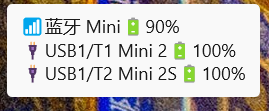

# 大疆麦克风电量软件说明

## 1. 软件概述

“大疆麦克风电量”是一款 Windows 通知区域工具，支持大疆蓝牙和 USB 无线连接两种连接模式，也支持两种模式同时接入和同时连接多个麦克风。蓝牙连接显示 DJI Mic Mini 向 Windows 上报的 HFP 电量百分比；USB 无线连接通过一个或多个接收器显示各 TX1/TX2 的粗略剩余电量和充电状态。

- 当前版本：2.0.1
- 支持系统：Windows 10/11 x64
- 支持设备：DJI Mic Mini 蓝牙免提设备；DJI Mic Mini 接收器 USB VID/PID `2CA3:4011`
- 安装范围：托盘 App 安装到当前 Windows 用户；`MI_00` / `MI_06` WinUSB 驱动为系统级设备驱动
- 网络访问：无
- 数据写入：不向 DJI 设备写入设置，仅读取状态帧

## 2. 主要功能

- 在 Windows 通知区域持续显示电池图标
- 同时读取在线的蓝牙麦克风和 USB 接收器，不设置连接模式优先级
- 托盘图标显示所有在线麦克风中的最低电量
- 鼠标悬停使用 `📶`、`🔌` 区分蓝牙和 USB，逐行显示型号短名和电量，不显示序列号；右键“设备详情”显示完整列表
- 设备详情按蓝牙和各 USB 接收器分类，每支麦克风一行
- 每行使用内含百分比的电池图标，并显示产品类型、序列识别号和充电状态
- 显示发射器是否正在充电
- 每 8 秒自动刷新一次，也可通过右键菜单立即刷新
- 支持通过当前用户登录计划任务自动启动，也可手动退出
- 使用颜色和填充量做粗略视觉区分
- 保持麦克风 USB Audio 接口原驱动，不影响正常录音
- 支持从 WinUSB 源头拦截大疆 USB 接收器连接键，避免系统音量变化与原生音量浮层，再映射为最多 6 个常规 Windows 按键组成的组合
- 内置 `右 Alt`、`右 Alt + Shift`、`右 Alt + 空格` 三组预设，并支持自定义录制和一键停用
- 支持 Typeless 文字补全后自动回车，可自定义最长等待时间和文字停止变化后再等待时间

### 2.1 两种连接模式

| 连接模式 | 连接方式 | 电量显示 |
| --- | --- | --- |
| 大疆蓝牙连接 | DJI Mic Mini 通过 Windows `Hands-Free` 连接 | 显示设备通过 HFP 上报的百分比 |
| USB 无线连接 | DJI Mic Mini 接收器通过 USB 连接电脑，发射器无线连接接收器 | 显示 TX1/TX2 的估算百分比和充电状态 |
| 蓝牙 + USB 双接入 | 两种连接同时在线，也可接入多个设备 | 图标采用所有麦克风的最低值，详情逐项显示全部值 |

### 2.2 状态栏悬停提示



鼠标移到 Windows 通知区域中的电池图标后，会逐行显示接口、型号短名和电量百分比。悬停提示不显示序列号；图标颜色和填充量用于快速判断剩余电量。

### 2.3 设备详情排版

右键“设备详情”后，列表采用以下结构：

```text
蓝牙连接（1 支）
  [90% 电池] 蓝牙麦克风 · DJI Mic Mini · 识别号 ******

USB1 接收器 · DJI Mic Mini 2 · SN **************（2 支）
  [100% 电池] TX1 · DJI Mic Mini 2  · 识别号 **************
  [100% 电池] TX2 · DJI Mic Mini 2S · 识别号 **************
```

百分比统一居中显示在电池图标内部，不再带波浪号或“约值”。USB 电量仍是档位换算结果；产品类型和序列号来自设备上报值，没有读取到身份帧时显示“未识别”。

### 2.4 连接键映射

部分 DJI 麦克风的连接键会被 Windows 识别为“音量加”。2.0.0 将接收器 `USB\VID_2CA3&PID_4011&MI_00` 精确绑定 WinUSB，由程序直接打开动态发现的 Interrupt-IN 端点。由于 Windows 不再为该接口创建 Consumer Control HID，按键不会先进入 Shell，不会改变系统音量，也不会触发原生音量浮层。程序只接受 `06-01-00` 按下和 `06-00-00` 松开报告，不同接收器分别维护按键状态，每个按下沿只发送一次用户选择的键盘组合。

托盘菜单提供以下选项：

- `启用映射`：打开或关闭连接键映射
- `右 Alt`
- `右 Alt + Shift`
- `右 Alt + 空格`
- `自定义按键组合…`：按住目标组合并全部松开，最多录制 6 个键
- `识别完成后自动回车（右 Alt）`
- `自动回车设置…`：调整最长等待时间和文字停止变化后再等待时间

首次运行默认启用并选择 `右 Alt`。设置保存在 `%LOCALAPPDATA%\大疆麦克风电量\button-mapping.ini`，重新运行或通过登录计划任务自动启动后继续生效。

2.0.0 不再使用 Raw Input、低级键盘钩子、Core Audio 音量恢复或按时间推断按键来源。程序只打开硬件 ID 精确匹配 `MI_00` 的 WinUSB 路径；普通键盘和其他 HID 仍由 Windows 原样处理。

默认 `右 Alt` 已按 Typeless 2.5.0 的 Dictate 快捷键适配：`SendInput` 同时提供虚拟键码与 `MapVirtualKey` 生成的真实扫描码，按下后保持 120 ms 再释放。Typeless 的听写是切换模式，按一次开始，再按一次停止。`右 Alt + Shift` 预设实际使用右 Shift，对应 Typeless Translation；`右 Alt + 空格` 可对应 Ask Anything。

使用 `右 Alt` 映射时，“识别完成后自动回车”默认开启。第一次短按会记录当前前台窗口和获得焦点的输入框；第二次短按且右 Alt 完全释放后才开始等待文字补全。只有同一输入框的文字相对停止听写前确实发生变化，并在最后一次变化后保持不变达到设定时间，程序才发送一次回车。默认最长等待时间为 20.0 秒，文字停止变化后再等待时间为 0.8 秒，这两个数值都可在设置窗口中修改。

本工具并不直接读取 Typeless 的“结束输入”状态。Typeless 的 `Thinking` 和进度条是 Electron 内部 DOM，Windows UI Automation 中没有稳定的文本、进度条角色或 AutomationId；而且 Typeless 会先结束该动画，再异步把文字插入目标应用。因此程序以目标输入框的文字变化与停止变化时间作为完成证据，不以进度条消失作为提交条件。目标应用需提供可写的 `ValuePattern`，或由 `Edit` 控件提供 `TextPattern`。程序只在内存中比较文字长度与指纹，不保存识别文字。目标输入框不可读取、文字没有变化、等待超时、前台窗口或输入焦点改变时，均不会发送回车。

当前 Windows 11 与 Typeless 2.5.0 组合已实机完成 2 个“开始—停止—文字补全—自动回车”周期验证；`status.txt` 记录两次回车均成功注入，并确认系统音量保持源头拦截。

WinUSB 绑定范围是整个 `MI_00`，所以该接口下的 Consumer Control、Telephone 和两个厂商自定义 HID collection 都不再交给 Windows。`MI_01` USB Audio 与 `MI_06` 电量接口是独立功能，不受此次切换影响。安装与恢复步骤见 [MI_00 WinUSB 安全配置说明](MI00-WINUSB.md)。蓝牙直连按键不经过 `MI_00`，尚不在当前按键拦截范围内。

自定义组合最多包含 6 个常规 Windows 按键。`Ctrl+Alt+Del` 等系统安全序列不能由 `SendInput` 模拟；高权限应用也可能拒绝普通权限进程发送的按键。

## 3. 电量显示规则

### 3.1 蓝牙模式

程序读取 DJI `Hands-Free AG` 设备节点上的 Windows HFP 电池值，直接显示 `0–100%` 百分比，不添加“约”字。颜色规则为：

- 10%及以上：绿色
- 6–9%：橙色
- 5%及以下：红色

本版本已在 Windows 11 上用一支 DJI Mic Mini 实机验证。微软建议 BR/EDR 免提设备通过 HFP HF Indicators 上报电量；Windows 当前将该值保存为设备属性，但应用读取所用的属性键未列入微软公开 API，未来 Windows 版本如有变化可能需要适配。

### 3.2 USB 模式

DJI USB 状态帧提供的是 1–7 档电量状态，并不包含精确的 `0–100%` 数值。本软件将档位映射为百分比显示；界面不再添加“约”，但这些 USB 数值仍属于档位换算结果：

| DJI 原始档位 | 悬停显示 | 图标颜色 | 视觉含义 |
| --- | --- | --- | --- |
| 1 | 100% | 绿色 | 满电 |
| 2 | 80% | 绿色 | 良好 |
| 3 | 60% | 绿色 | 良好 |
| 4 | 40% | 绿色 | 良好 |
| 5 | 20% | 绿色 | 电量低 |
| 6 | 9% | 橙色 | 低于 10%，建议充电 |
| 7 | 5% | 红色 | 极低，应尽快充电 |

这些百分比只用于快速判断，不代表 DJI 官方提供的精确剩余电量，也不适合用于计算精确续航时间。

无论是两个发射器、多个蓝牙麦克风、多个 USB 接收器，还是蓝牙与 USB 混合接入，托盘图标都采用所有已知电量中的最低值。蓝牙值为设备上报百分比；USB 值为档位换算百分比，界面不再显示“约”。

## 4. 安装前准备

### 4.1 蓝牙连接

1. 在 Windows 蓝牙设置中配对 DJI Mic Mini。
2. 确认出现名称包含 `DJI Mic Mini` 的 `Hands-Free` 录音端点。
3. 蓝牙模式不需要安装 WinUSB。

### 4.2 USB 连接设备

使用 USB 将 DJI Mic Mini 接收器连接到电脑，并确认 Windows 能正常识别麦克风音频设备。

### 4.3 安装 WinUSB

软件通过两个彼此独立的 WinUSB 子接口工作。安装驱动时必须满足以下条件：

- 电量读取使用 `USB\VID_2CA3&PID_4011&MI_06`，即 Interface 6
- 连接键完全拦截使用 `USB\VID_2CA3&PID_4011&MI_00`，即 Interface 0
- 两者驱动类型均为 WinUSB
- 不要替换 USB Audio/音频接口的驱动

正式包不包含本项目自制的驱动签名脚本。需要连接键完全拦截时，请从 [Zadig 官方网站](https://zadig.akeo.ie/) 下载带 Akeo Consulting 数字签名的工具，启用 “List All Devices”，只选择硬件 ID 含 `USB\VID_2CA3&PID_4011&MI_00` 的 Interface 0，并将该子接口替换为 `WinUSB`。根据 [libwdi 官方证书实践说明](https://github.com/pbatard/libwdi/wiki/Certification-Practice-Statement)，Zadig/libwdi 会在目标电脑为该设备即时生成自签名证书，加入本机 Root 与 Trusted Publishers，完成目录签名后销毁私钥；证书公钥会保留，用户可在恢复驱动后按精确主题和指纹删除。不接受这项系统证书变更时，请只使用电量功能。完整核对、验证与恢复步骤见 [MI_00 WinUSB 安全配置说明](MI00-WINUSB.md)。

> 重要：绝不能匹配父设备 `USB\VID_2CA3&PID_4011` 或音频接口 `MI_01`。如果把 WinUSB 安装到了音频接口，麦克风可能无法录音；请在设备管理器恢复 Windows USB Audio 驱动。

### 4.4 连接键映射条件

连接键映射要求 `MI_00` 已使用由 Zadig/libwdi 配置的 Windows `WinUSB`。当前真机确认该接口的 Interrupt-IN 端点为 `0x82`；程序不会硬编码端点，而是启动时查询接口描述符。按键协议验证范围是 `06-01-00` / `06-00-00`；蓝牙直连按键和其他 DJI 型号尚未宣称支持。

## 5. 安装与启动

### 5.1 直接运行

1. 打开 [GitHub Releases](https://github.com/chenleshu/dji-mic-battery-tray/releases)。
2. 下载 `DJI-Mic-Battery-Tray-v2.0.1.exe`；若需要安装器、桌面快捷方式和登录后自动启动，请下载 `DJI-Mic-Battery-Tray-v2.0.1.zip`。
3. 若要使用连接键完全拦截，按 [MI_00 WinUSB 安全配置说明](MI00-WINUSB.md) 只把 Interface 0 切换为 WinUSB；仅查看电量可直接双击 EXE。
4. 双击运行。
5. 在 Windows 通知区域找到电池图标；如果未直接显示，请展开“隐藏的图标”。

下载后请使用同一 Release 中的 `SHA256SUMS.txt` 核对 `DJI-Mic-Battery-Tray-v2.0.1.exe`、完整包和源码包，不要沿用旧版本的哈希值。

### 5.2 安装到当前用户

从源码仓库运行：

```powershell
powershell -ExecutionPolicy Bypass -File .\scripts\build.ps1
powershell -ExecutionPolicy Bypass -File .\scripts\install.ps1
```

程序安装位置：

```text
%LOCALAPPDATA%\DjiMicBatteryTray\DjiMicBatteryTray.exe
```

安装脚本会在当前用户桌面创建“大疆麦克风电量”快捷方式，并注册名称为“大疆麦克风电量”的 Windows 登录计划任务。任务仅使用当前登录用户的交互令牌和普通权限，登录后延迟 10 秒启动：

```text
触发器：当前用户登录
程序：%LOCALAPPDATA%\DjiMicBatteryTray\DjiMicBatteryTray.exe
参数：--autostart
```

v2.0.1 不再依赖 `HKCU\Software\Microsoft\Windows\CurrentVersion\Run`。安装器会删除同名旧启动值，核对计划任务的用户、路径、参数、工作目录和启用状态，再受控启动一次该任务；只有在 30 秒内确认恰好一个安装路径下的进程，并从新生成的状态文件核对版本、进程 ID、进程路径、`autostart` 启动来源和任务启用状态后，安装才判定为成功。该受控任务启动链已在当前 Windows 11 实机验证。本次没有注销或重启 Windows，因此真实的下一次登录触发仍需在用户下次登录时观察，文档不将其标记为已实机验证。

托盘 App 不需要管理员权限，只安装到当前用户；通过 Zadig 更改 `MI_00` 属于系统设备驱动操作，需要管理员权限。

## 6. 日常使用

### 6.1 鼠标悬停

将鼠标移到托盘图标上，可看到类似以下内容：

```text
📶蓝牙 Mini🔋90%
🔌USB1/T1 Mini 2🔋100%
🔌USB1/T2 Mini 2S🔋100%
```

Windows 系统托盘的原生悬停框有严格的文字长度限制，因此型号会省略公共前缀 `DJI Mic`，USB 发射器缩写为 `T1/T2`，只保留 `Mini`、`Mini 2`、`Mini 2S` 等关键部分。悬停框不显示序列号；完整产品名称和序列识别号可在右键“设备详情”中查看。右键详情页的蓝牙和 USB 分组标题使用独立绘制的接口图标。

仅 USB 模式会显示：

```text
大疆麦克风电量 | TX1 40% | TX2 80%
```

正在充电的发射器后面会显示闪电符号。

### 6.2 右键菜单

- `立即刷新`：马上读取一次状态
- `设备详情`：逐项查看所有蓝牙麦克风和 USB 发射器的电量
- `连接键短按映射`：启用或关闭映射，选择预设、录制自定义组合，并配置 Typeless 自动回车
- `登录后自动启动`：启用或关闭当前用户的 Windows 登录计划任务；任务不存在时会显示为未启用，不再因 `FileNotFoundException` 导致菜单初始化或检查失败
- `退出`：关闭托盘程序，不会卸载软件

## 7. 升级

使用源码安装脚本升级时，脚本会先停止已安装的进程、等待文件锁释放，将 EXE 安装到 `%LOCALAPPDATA%\DjiMicBatteryTray\DjiMicBatteryTray.exe`，更新桌面快捷方式和登录计划任务，再执行受控启动验收。

直接运行发行版时，退出旧版本后运行新版 EXE 即可。建议只保留一个运行中的版本，避免多个程序竞争同一个 WinUSB 接口。

## 8. 卸载

从源码仓库执行：

```powershell
powershell -ExecutionPolicy Bypass -File .\scripts\uninstall.ps1
```

卸载脚本会停止程序、删除当前用户的登录计划任务、同名旧 `Run` 启动值和由本安装器创建的桌面快捷方式，并删除默认安装目录及本机状态目录。若还要把接收器 `MI_00` 恢复为 Microsoft HidUsb，请按 [MI_00 WinUSB 安全配置说明](MI00-WINUSB.md) 中的恢复步骤操作。

如果只是直接运行了 Release EXE，没有执行安装脚本，则退出托盘程序后删除下载的 EXE 即可。

## 9. 故障排查

### 9.1 通知区域没有图标

- 展开 Windows 任务栏右侧“隐藏的图标”
- 安装版确认 `%LOCALAPPDATA%\DjiMicBatteryTray\DjiMicBatteryTray.exe` 正在运行；直接运行版则确认下载的发行版 EXE 正在运行
- 再次双击 EXE；单实例保护会避免重复运行
- 若登录后没有自动出现，右键托盘图标确认“登录后自动启动”已勾选，并在 Windows 任务计划程序中核对同名任务是否启用、操作路径是否为 `%LOCALAPPDATA%\DjiMicBatteryTray\DjiMicBatteryTray.exe`

### 9.2 提示需要安装 WinUSB

- 蓝牙模式不需要 WinUSB；如果已经连接蓝牙但仍看到该提示，请确认 `Hands-Free` 录音端点在线
- 确认接收器已通过 USB 连接
- 电量读取：核对 Interface 6 使用 WinUSB，硬件 ID 包含 `VID_2CA3&PID_4011&MI_06`
- 连接键映射：核对 Interface 0 使用 WinUSB，硬件 ID 包含 `VID_2CA3&PID_4011&MI_00`

### 9.3 提示读取失败或拒绝访问

WinUSB 数据接口通常只能由一个程序占用。请关闭 DJI Mic Control 或其他正在访问该接收器数据接口的软件，然后选择“立即刷新”。

### 9.4 接收器在线但没有电量

- 确认发射器已经开机并与接收器配对
- 等待一个刷新周期或选择“立即刷新”
- 如果接收器固件使用软件尚未识别的协议版本，程序会显示不支持提示

### 9.5 蓝牙已连接但没有电量

- 确认 Windows 中 `DJI Mic Mini ... Hands-Free` 录音端点状态正常
- 等待一个刷新周期或选择“立即刷新”
- 部分蓝牙设备只提供音频、不通过 HFP 上报电量；这种情况程序会显示“电量未知”

### 9.6 蓝牙掉线后仍显示旧电量

v1.3.0 起程序会核对 Windows 免提录音端点是否处于 Active。掉线端点会被排除，在线 USB 麦克风会在下一个刷新周期自动接管显示。若仍显示旧值，请确认运行的是 v1.3.0 或更高版本并选择“立即刷新”。

### 9.7 麦克风不能录音

这通常意味着 WinUSB 被误装到了音频接口。请在设备管理器中恢复 `MI_01` 的 Windows USB Audio 驱动，并确保 WinUSB 只绑定到 `MI_00` 和 `MI_06`。

### 9.8 连接键仍只调节音量或没有产生映射

- 在托盘“连接键短按映射”中确认“启用映射”已勾选，并选择一个目标组合
- 确认 `MI_00` 使用 WinUSB，托盘菜单不再显示“需要 MI_00 WinUSB”；蓝牙直连按键不在当前验证范围内
- 打开 `%LOCALAPPDATA%\大疆麦克风电量\status.txt`，连续短按后检查“大疆按键输入”“大疆按键触发”“大疆按键释放”计数是否增加
- “最近USB报告”应在按下时出现 `06-01-00`，松开时出现 `06-00-00`
- 如果目标程序以管理员权限运行，也请以管理员权限运行本工具，否则 Windows 可能拒绝按键注入

### 9.9 按连接键时仍出现音量提示

正确安装 `MI_00` WinUSB 后，Windows 不应再收到大疆 Consumer Control 音量命令。请检查 `status.txt` 中“连接键驱动=ok”“连接键监听=ok”“系统音量拦截=source_blocked”。若托盘显示“需要 MI_00 WinUSB”，请按安全配置说明重新核对所选接口和驱动。普通键盘音量键仍会正常显示系统音量提示。

### 9.10 识别结束后没有自动回车

- 确认映射为 `右 Alt`，并勾选“识别完成后自动回车（右 Alt）”
- 开始识别前让目标输入框保持键盘焦点，处理中不要切换到其他窗口或输入框
- 查看 `status.txt` 的“自动回车状态”；“当前输入框不可识别”表示目标应用没有提供可读的 Windows UI Automation 文本模式
- “等待超时，未按回车”表示最长等待时间内没有检测到有效文字变化，或文字始终没有保持稳定。识别处理时间较长时可增加“最长等待时间”；文字经常分批追加时可增加“文字停止变化后再等待”时间
- 空语音、识别失败、焦点变化和超时均会安全取消，不会强制回车

## 10. 状态与日志

安装版会在以下目录保存本机状态和错误日志：

```text
%LOCALAPPDATA%\大疆麦克风电量\status.txt
%LOCALAPPDATA%\大疆麦克风电量\app.log
```

`status.txt` 记录麦克风数量、最低电量摘要和每支麦克风的来源、产品类型、序列识别号、接收器序列号、电量、USB 原始档位及充电状态。它还记录 `MI_00` 驱动与监听状态、Interrupt-IN 端点、大疆按键输入、映射触发、按键释放、源头拦截状态、最近 USB 报告、最近映射时间，以及自动回车开关、状态、两个时间参数、次数和最近执行时间。`app.log` 只在发生异常时追加错误信息。

## 11. 技术说明

程序使用 Windows Forms `NotifyIcon` 创建通知区域图标。每次刷新在后台线程中同时枚举所有状态为 Active 的 DJI `Hands-Free` 录音端点和所有匹配的 WinUSB 设备路径，读取完成后再回到界面线程更新托盘，避免 3.5 秒 USB 读取窗口阻塞菜单与按键输入。蓝牙读取 Windows HFP 电池值和设备名；USB v2 同时合并状态帧与身份帧，读取各 TX 的产品名称、序列号、电量和充电状态。多个 USB 接收器并行打开以下数据通道：

- 设备：`VID_2CA3&PID_4011`
- 接口：Interface 6
- Bulk-IN：`0x86`
- 轮询周期：8 秒
- 单次读取超时：3.5 秒

连接键映射使用独立后台线程读取 `MI_00` 各设备实例注册的 `DeviceInterfaceGUIDs`，所有枚举结果继续严格核对 `VID_2CA3&PID_4011&MI_00`，再经 `WinUsb_QueryPipe` 动态找到 Interrupt-IN，以可取消的 overlapped I/O 持续读取。每个 USB transfer 单独解析，只接受长度严格为 3 的 `06-01-00` / `06-00-00`，扩展或未知报告均忽略。按下报告触发一次带真实扫描码的 `SendInput` 组合键，120 ms 后由非阻塞定时器释放；松开报告按设备重置物理键状态。由于 `MI_00` 已脱离 HidUsb，Windows Shell 不会同时处理大疆的音量命令。

自动回车使用全局 `Idle / Recording / AwaitingCompletion` 状态机，因为多支麦克风控制的是同一个 Typeless 会话。第一次按键注入右 Alt 前同步记录目标 UI Automation 控件；第二次按键注入前重新读取同一目标的文字指纹，右 Alt 完全释放后才开始最长等待计时，避免形成 `Alt+Enter`。每次检测到文字继续变化都会重新计算补全后等待时间。发送回车前还会在界面线程再次核对前台窗口、输入焦点和文字指纹，全部一致时才注入完整的 Enter 按下/释放。

登录后自动启动由 Windows Task Scheduler 2.0 COM API 管理。程序会完整校验任务是否属于当前用户、是否为登录触发、是否采用普通权限交互令牌、是否允许电池供电、是否禁止重复实例，以及执行路径、`--autostart` 参数和工作目录是否与当前安装一致。查询一个尚未创建的任务时，Windows 会返回 `FileNotFoundException` 对应的错误码；v2.0.1 将此状态正确识别为“未启用”，其他异常仍会继续报告。

USB 状态解码参考了开源项目 [ShadowBitBasher/DJI-Mic-Control](https://github.com/ShadowBitBasher/DJI-Mic-Control)。软件采用 [The Unlicense](../LICENSE) 发布。

## 12. 隐私与安全

- 软件不连接互联网
- 不上传麦克风音频、电量或设备标识
- 不录制、保存或分析音频内容
- 自动回车只在内存中比较目标输入框的文字指纹，不记录文字正文
- 不向接收器写入配置命令
- 只在本机保存最近状态和错误日志

当前 EXE 未使用商业代码签名证书，其他电脑首次运行时 Windows SmartScreen 可能要求确认。可通过 Release 中的 `SHA256SUMS.txt` 校验文件完整性。

## 13. 项目与下载

- GitHub 仓库：https://github.com/chenleshu/dji-mic-battery-tray
- Releases：https://github.com/chenleshu/dji-mic-battery-tray/releases
- 当前版本：https://github.com/chenleshu/dji-mic-battery-tray/releases/tag/v2.0.1
