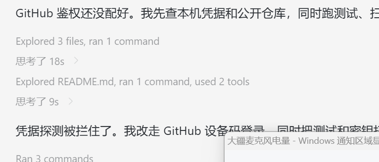

# 大疆麦克风电量软件说明

## 1. 软件概述

“大疆麦克风电量”是一款 Windows 通知区域工具，支持大疆蓝牙和 USB 无线连接两种连接模式，也支持两种模式同时接入和同时连接多个麦克风。蓝牙连接显示 DJI Mic Mini 向 Windows 上报的 HFP 电量百分比；USB 无线连接通过一个或多个接收器显示各 TX1/TX2 的粗略剩余电量和充电状态。

- 当前版本：1.4.0
- 支持系统：Windows 10/11 x64
- 支持设备：DJI Mic Mini 蓝牙免提设备；DJI Mic Mini 接收器 USB VID/PID `2CA3:4011`
- 安装范围：当前 Windows 用户
- 网络访问：无
- 数据写入：不向 DJI 设备写入设置，仅读取状态帧

## 2. 主要功能

- 在 Windows 通知区域持续显示电池图标
- 同时读取在线的蓝牙麦克风和 USB 接收器，不设置连接模式优先级
- 托盘图标显示所有在线麦克风中的最低电量
- 鼠标悬停显示各麦克风电量；右键“设备详情”显示完整列表
- 设备详情按蓝牙和各 USB 接收器分类，每支麦克风一行
- 每行使用内含百分比的电池图标，并显示产品类型、序列识别号和充电状态
- 显示发射器是否正在充电
- 每 8 秒自动刷新一次，也可通过右键菜单立即刷新
- 支持开机自动启动和手动退出
- 使用颜色和填充量做粗略视觉区分
- 保持麦克风 USB Audio 接口原驱动，不影响正常录音

### 2.1 两种连接模式

| 连接模式 | 连接方式 | 电量显示 |
| --- | --- | --- |
| 大疆蓝牙连接 | DJI Mic Mini 通过 Windows `Hands-Free` 连接 | 显示设备通过 HFP 上报的百分比 |
| USB 无线连接 | DJI Mic Mini 接收器通过 USB 连接电脑，发射器无线连接接收器 | 显示 TX1/TX2 的估算百分比和充电状态 |
| 蓝牙 + USB 双接入 | 两种连接同时在线，也可接入多个设备 | 图标采用所有麦克风的最低值，详情逐项显示全部值 |

### 2.2 托盘图标截图



截图展示 Windows 通知区域中的托盘显示效果。鼠标悬停时会显示连接模式、设备名称和电量百分比；图标颜色和填充量用于快速判断剩余电量。

### 2.3 设备详情排版

右键“设备详情”后，列表采用以下结构：

```text
蓝牙连接（1 支）
  [90% 电池] 蓝牙麦克风 · DJI Mic Mini · 识别号 ******

USB1 接收器 · DJI Mic Mini 2 · SN **************（2 支）
  [~100% 电池] TX1 · DJI Mic Mini 2  · 识别号 ************** · 约值
  [~100% 电池] TX2 · DJI Mic Mini 2S · 识别号 ************** · 约值
```

蓝牙百分比来自 Windows HFP，因此不带波浪号；USB 电量是档位换算，图标用 `~` 表示“约”。产品类型和序列号来自设备上报值；没有读取到身份帧时显示“未识别”。

## 3. 电量显示规则

### 3.1 蓝牙模式

程序读取 DJI `Hands-Free AG` 设备节点上的 Windows HFP 电池值，直接显示 `0–100%` 百分比，不添加“约”字。颜色规则为：

- 10%及以上：绿色
- 6–9%：橙色
- 5%及以下：红色

本版本已在 Windows 11 上用 `DJI Mic Mini-62D525` 实机验证。微软建议 BR/EDR 免提设备通过 HFP HF Indicators 上报电量；Windows 当前将该值保存为设备属性，但应用读取所用的属性键未列入微软公开 API，未来 Windows 版本如有变化可能需要适配。

### 3.2 USB 模式

DJI USB 状态帧提供的是 1–7 档电量状态，并不包含精确的 `0–100%` 数值。本软件将档位映射为明确标注“约”的估算百分比：

| DJI 原始档位 | 悬停显示 | 图标颜色 | 视觉含义 |
| --- | --- | --- | --- |
| 1 | 约 100% | 绿色 | 满电 |
| 2 | 约 80% | 绿色 | 良好 |
| 3 | 约 60% | 绿色 | 良好 |
| 4 | 约 40% | 绿色 | 良好 |
| 5 | 约 20% | 绿色 | 电量低 |
| 6 | 约 9% | 橙色 | 低于 10%，建议充电 |
| 7 | 约 5% | 红色 | 极低，应尽快充电 |

这些百分比只用于快速判断，不代表 DJI 官方提供的精确剩余电量，也不适合用于计算精确续航时间。

无论是两个发射器、多个蓝牙麦克风、多个 USB 接收器，还是蓝牙与 USB 混合接入，托盘图标都采用所有已知电量中的最低值。蓝牙值为精确百分比，USB 值继续标注“约”。

## 4. 安装前准备

### 4.1 蓝牙连接

1. 在 Windows 蓝牙设置中配对 DJI Mic Mini。
2. 确认出现名称包含 `DJI Mic Mini` 的 `Hands-Free` 录音端点。
3. 蓝牙模式不需要安装 WinUSB。

### 4.2 USB 连接设备

使用 USB 将 DJI Mic Mini 接收器连接到电脑，并确认 Windows 能正常识别麦克风音频设备。

### 4.3 安装 WinUSB

软件需要通过 WinUSB 访问接收器的厂商数据接口。安装驱动时必须满足以下条件：

- 只选择 `USB\VID_2CA3&PID_4011&MI_06`，即 Interface 6
- 驱动类型选择 WinUSB
- 不要替换 USB Audio/音频接口的驱动

使用 Zadig 时可启用 “List All Devices”，选择名称中对应 Interface 6 的 `Wireless Mic Rx`，核对硬件 ID 后再安装 WinUSB。

> 重要：如果把 WinUSB 安装到了音频接口，麦克风可能无法录音。此时应在设备管理器中恢复音频接口的 Windows USB Audio 驱动，再只为 `MI_06` 安装 WinUSB。

## 5. 安装与启动

### 5.1 直接运行

1. 打开 [GitHub Releases](https://github.com/chenleshu/dji-mic-battery-tray/releases)。
2. 下载 `DJI-Mic-Battery-Tray-v1.4.0.exe`。
3. 双击运行。
4. 在 Windows 通知区域找到电池图标；如果未直接显示，请展开“隐藏的图标”。

下载文件的 SHA-256：

```text
5425972E17DD69180D51D914791420D1A9B9FA79BB521335DF8FD1CE39A74B3E
```

### 5.2 安装到当前用户

从源码仓库运行：

```powershell
powershell -ExecutionPolicy Bypass -File .\scripts\build.ps1
powershell -ExecutionPolicy Bypass -File .\scripts\install.ps1
```

程序安装位置：

```text
%LOCALAPPDATA%\大疆麦克风电量\大疆麦克风电量.exe
```

安装脚本会写入当前用户的 Windows 登录启动项：

```text
HKCU\Software\Microsoft\Windows\CurrentVersion\Run\大疆麦克风电量
```

不需要管理员权限，也不会为其他 Windows 用户安装。

## 6. 日常使用

### 6.1 鼠标悬停

将鼠标移到托盘图标上，可看到类似以下内容：

```text
大疆麦克风电量 | 蓝牙 40% | USB1/TX1 约20%
```

仅 USB 模式会显示：

```text
大疆麦克风电量 | TX1 约 40% | TX2 约 80%
```

正在充电的发射器后面会显示闪电符号。

### 6.2 右键菜单

- `立即刷新`：马上读取一次状态
- `设备详情`：逐项查看所有蓝牙麦克风和 USB 发射器的电量
- `开机自动启动`：启用或关闭当前用户的登录启动项
- `退出`：关闭托盘程序，不会卸载软件

## 7. 升级

使用源码安装脚本升级时，脚本会先停止已安装的进程、等待文件锁释放、覆盖 EXE，然后重新启动。

直接运行发行版时，退出旧版本后运行新版 EXE 即可。建议只保留一个运行中的版本，避免多个程序竞争同一个 WinUSB 接口。

## 8. 卸载

从源码仓库执行：

```powershell
powershell -ExecutionPolicy Bypass -File .\scripts\uninstall.ps1
```

卸载脚本会停止程序、删除当前用户的开机启动项，并删除默认安装目录。

如果只是直接运行了 Release EXE，没有执行安装脚本，则退出托盘程序后删除下载的 EXE 即可。

## 9. 故障排查

### 9.1 通知区域没有图标

- 展开 Windows 任务栏右侧“隐藏的图标”
- 确认 `大疆麦克风电量.exe` 正在运行
- 再次双击 EXE；单实例保护会避免重复运行

### 9.2 提示需要安装 WinUSB

- 蓝牙模式不需要 WinUSB；如果已经连接蓝牙但仍看到该提示，请确认 `Hands-Free` 录音端点在线
- 确认接收器已通过 USB 连接
- 在设备管理器中核对 Interface 6 是否使用 WinUSB
- 确认硬件 ID 包含 `VID_2CA3&PID_4011&MI_06`

### 9.3 提示读取失败或拒绝访问

WinUSB 数据接口通常只能由一个程序占用。请关闭 DJI Mic Control 或其他正在访问该接收器数据接口的软件，然后选择“立即刷新”。

### 9.4 接收器在线但没有电量

- 确认发射器已经开机并与接收器配对
- 等待一个刷新周期或选择“立即刷新”
- 如果接收器固件使用软件尚未识别的协议版本，程序会显示不支持提示

### 9.5 蓝牙已连接但没有电量

- 确认 Windows 中 `DJI Mic Mini ... Hands-Free` 录音端点状态正常
- 等待一个刷新周期或选择“立即刷新”
- 部分蓝牙设备只提供音频、不通过 HFP 上报电量；这种情况程序会显示“电量未知”

### 9.6 蓝牙掉线后仍显示旧电量

v1.3.0 起程序会核对 Windows 免提录音端点是否处于 Active。掉线端点会被排除，在线 USB 麦克风会在下一个刷新周期自动接管显示。若仍显示旧值，请确认运行的是 v1.3.0 或更高版本并选择“立即刷新”。

### 9.7 麦克风不能录音

这通常意味着 WinUSB 被误装到了音频接口。请在设备管理器中恢复音频接口的 Windows USB Audio 驱动，并确保 WinUSB 只绑定到 Interface 6。

## 10. 状态与日志

安装版会在以下目录保存本机状态和错误日志：

```text
%LOCALAPPDATA%\大疆麦克风电量\status.txt
%LOCALAPPDATA%\大疆麦克风电量\app.log
```

`status.txt` 记录麦克风数量、最低电量摘要和每支麦克风的来源、产品类型、序列识别号、接收器序列号、电量、USB 原始档位及充电状态。`app.log` 只在发生异常时追加错误信息。

## 11. 技术说明

程序使用 Windows Forms `NotifyIcon` 创建通知区域图标。每次刷新同时枚举所有状态为 Active 的 DJI `Hands-Free` 录音端点和所有匹配的 WinUSB 设备路径。蓝牙读取 Windows HFP 电池值和设备名；USB v2 同时合并状态帧与身份帧，读取各 TX 的产品名称、序列号、电量和充电状态。多个 USB 接收器并行打开以下数据通道：

- 设备：`VID_2CA3&PID_4011`
- 接口：Interface 6
- Bulk-IN：`0x86`
- 轮询周期：8 秒
- 单次读取超时：3.5 秒

USB 状态解码参考了开源项目 [ShadowBitBasher/DJI-Mic-Control](https://github.com/ShadowBitBasher/DJI-Mic-Control)。软件采用 [The Unlicense](../LICENSE) 发布。

## 12. 隐私与安全

- 软件不连接互联网
- 不上传麦克风音频、电量或设备标识
- 不录制、保存或分析音频内容
- 不向接收器写入配置命令
- 只在本机保存最近状态和错误日志

当前 EXE 未使用商业代码签名证书，其他电脑首次运行时 Windows SmartScreen 可能要求确认。可通过 Release 中的 `SHA256SUMS.txt` 校验文件完整性。

## 13. 项目与下载

- GitHub 仓库：https://github.com/chenleshu/dji-mic-battery-tray
- Releases：https://github.com/chenleshu/dji-mic-battery-tray/releases
- 当前版本：https://github.com/chenleshu/dji-mic-battery-tray/releases/tag/v1.4.0
